# Mineração de Dados

## Resumo

## Aula 1: Introdução

### Conceito

> Processo de descoberta de novas informações e conhecimento,
no formato de modelos, regras e padrões, a partir de bases de dados.

```
A base de dados pode ser um banco de dados tradicional, 
um data warehouse ou qualquer outra forma de repositório.
```

### Aplicações de mineração de dados

- Detecção de spam; 
- Detecção de patologias por análise de imagens;
- Detecção de fraudes;
- Mineração de regras de associação; e
- Análise de sentimentos.

### Classificação

* Mineração Preditiva; e
* Mineração Descritiva.

### Mineração Preditiva

> Deseja-se prever o valor desconhecido de um determinado atributo, a
partir da análise histórica dos dados armazenados na base (base de treinamento).

### Mineração Descritiva

> Procura-se extrair padrões e regras que descrevam características importantes
dos dados do domínio de aplicação.

### Mineração de Dados

> Etapa principal do processo de KDD (Knowledge Discovery in Databases), na qual é
realizada a busca por novas informações e conhecimento.

### KDD (Knowledge Discovery in Databases)

É composto por seis fases (Navathe):

* Seleção de dados;
* Limpeza de dados;
* Enriquecimento dos dados;
* Transformação dos dados,
* **Mineração dos dados**; e
* Apresentação e análise dos resultados.

### Tarefas em mineração de dados

* Regras de Associação (RA);
* Padrões de Sequências;
* Classificação; e
* Clusterização.

### Regras de Associação (RA) aka market basket analysis

> Uma RA representa um padrão de relacionamento entre itens de dados do domínio
da aplicação que ocorre com uma determinada frequência na base.

Exemplos:

```
{fralda} => {cerveja}
{pão, manteiga} => {leite} , confiança de 80%
{candidíase} => {pneumonia}
```

RAs são extraídas de bases de dados que contém transações.

Transações:

|ID|Itens comprados|
|:-:|:------------:|
|1| leite, pão, refrigerante|
|2| cerveja, carne|
|3| cerveja, fralda, leite, refrigerante|
|4| cerveja, fralda, leite, pão|
|5| fralda, leite, refrigerante|

RAs: \{A} => \{B}

| RA | Confiança (A&B)/A | Suporte (A&B)/Total |
|:--:|:---------:|:-------:|
|\{fralda} => \{cerveja}|66% (2/3)|médio (2/5)|
|\{fralda} => \{leite}|100% (1/1)|alto (3/5)|
|\{leite} => \{fralda}|75% (3/4)|alto (3/5)|
|\{carne} => \{cerveja}|100%(1/1)|baixo (1/5)|

### Padrões de Sequências

> Padrões de Sequência representam sequências de conjuntos de itens que ocorrem
nas transações de diferentes consumidores, com determinada frequência (em ordem).

Exemplo:

|Consumidor|Data/Hora|Produtos|
|:--:|:---------:|:-------:|
|João|01.08.2001/17:01|leite, pão|
|João|03.08.2001/14:25|carne, cerveja|
|João|10.08.2001/21:15|queijo, manteiga, sal|
|-|-|-|
|Marcos|05.08.2001/10:16|leite, ovos|
|Marcos|08.08.2001/18:30|leite, manteiga|

```
Padrão de Sequência: {(leite)(queijo, manteiga)}
```

### Classificação

> Um classificador estima/prevê, entre um conjunto pré-definido de classes, aquela
a qual pertence um elemento, a partir de seus atributos.

* Em última análise é uma função que realiza tal mapeamento; 
* A função é descoberta a partir de um modelo de função/técnica (escolhida) e 
uma base de treinamento.


### Agrupamento (Clustering)

> Agrupar ("clusterizar") significa identificar um conjunto finito de categorias
>(ou grupos/clusters) que contêm objetos similares.

**ATENÇÃO:** Grupos não são previamente definidos!

Exemplo:


### Técnicas de Mineração de Dados

- Classificação
	- Árvores de Decisão;
	- k-NN;
	- Classificador Bayesiano, etc.
- Associação/Padrões
	- Algoritmo de Extração de Regras de Associação/Padrões
- Clusterização
	- Algoritmos de Particionamento;
	- Algoritmos Hierárquicos, etc.

### Técnica Supervisionada vs Técnica Não Supervisionada

**Supervisionado**: *Quando o atributo classe dos elementos da base de
treinamento é conhecido, uma vez que tal classe foi informada a partir de
uma ação externa (supervisionada).* Ex.: ***Classificação.***

**Não Supervisionada**: *Quando os elementos da base de treinamento não possuem
um atributo classe previamente informado, bem como ausência de separação em
grupos (nem mesmo em quantidade de grupos).* Ex.: ***Clusterização.***

### Modelo de Mineração de Dados


### Mineração de Dados Direta

> Através de uma técnica de mineração, extrai-se ou treina-se um modelo que 
> será posteriormente utilizado. 

* Tarefas Preditivas: classificação, regressão, etc.

```
Mineração caracterizada pela existência de um campo específico 
cujo valor deve ser estimado a partir dos valores dos demais 
atributos.
```

### Mineração de Dados Indireta

> Através de uma técnica de mineração, extraem-se padrões significativos que 
serão posteriormente avaliados.

* Tarefas Descritivas: regras de associação, clusters, etc.

```
O resultado da mineração complementa o conhecimento do especialista e deverá 
ser examinado e avaliado por este.
```

## Aula 2: Árvore de Decisão (Classificação)

### Conceito de Classificação

> Identificar a classe a qual um elemento pertence a partir de suas características.
O conjunto de possíveis classes é discreto e predefinido.

Exemplo:


Características:


### Regras de Classificação

> Cada caminho da raiz até a folha representa uma regra, definida como a conjunção
das condições percorridas, implicando no valor da classe encontrada na folha.

**ATENÇÃO:** A árvore deve ser definida de forma que, para um mesmo registro, 
haja um e apenas um caminho da raiz até a folha.

```
(Sal ≤ 5k) ⇒ Classe = B
(Sal > 5k) ∧ (Idade > 40) ⇒ Classe = C
(Sal > 5k) ∧ (Idade ≤ 40) ∧ (TEmpr = Autônomo) ⇒ Classe = A
(Sal > 5k) ∧ (Idade ≤ 40) ∧ (TEmpr = Indústria) ⇒ Classe = B
(Sal > 5k) ∧ (Idade ≤ 40) ∧ (TEmpr = Academia) ⇒ Classe = B
```

### Taxa de Erro de Treinamento de Regras


### Taxa de Erro Total ou Erro de Treinamento

> A taxa de erro total de uma AD equivale à soma ponderada das taxas de erro 
de cada folha, considerando-se a probabilidade associada a esta folha.

Exemplo:
```
Erro Total = 0,25 * X + 0,33 * Y, onde:
X = 4/13, onde 4 é a # da regra verde e 13 é o total de tuplas.
Y = 3/13, onde 3 é a # da regra amarela e 13 é o total de tuplas.
```

**ATENÇÃO:** O erro é calculado sobre os dados de _treinamento_!

### Algoritmos ID3, C4.5 e CART

Estrutura comum aos algoritmos:

- Entrada:
	- Base de treinamento;
	- Lista de atributos independentes; e
	- Definição do atributo dependente (alvo ou objetivo).
- Saída:
	- AD que permite classificar um novo registro a partir de seus atributos independentes.
	
### Como gerar a melhor AD? Como escolher os atributos/nós?

O algoritmo ID3 utiliza medida de Ganho de Informação, que se baseia no conceito
de entropia. Utiliza-se de uma heurística que visa minimizar a quantidade de testes
necessários para classificar um registro.


### Medida Gain Ratio

Um problema da medida Ganho de Informação é que atributos com muitos valores 
são beneficiados. Caso extremo: atributo identificador (CPF).

O algoritmo C4.5 tenta resolver esse problema com uma extensão da medida 
Ganho de Informação, chamada Gain Ratio. Trata-se de um tipo de normalização 
do Ganho de Informação.


### Medida Gini Index

Utilizada pelo algoritmo CART, tem por objetivo medir o grau de impureza da 
distribuição de classes da base D.


## Aula 3: Random Forest

### Características

- Trata-se de um classificador composto por um comitê (ensemble) de N árvores de 
decisão, onde N é um parâmetro de entrada da técnica. No momento da classificação,
as árvores votam e a classe predominante será a classe da instância de entrada.
- Seja D a base de treinamento, com d elementos. Cada árvore é construída a partir
de uma amostra de D com reposição, de tamanho d. Portanto, algumas tuplas de D 
podem aparecer mais de uma vez na amostra, enquanto outras podem não aparecer. 
Aproximadamente 63,2% da base original ocorre em cada amostra.
- A cada vez que um nó da árvore está sendo construído gera-se um subconjunto 
aleatório dos atributos disponíveis, de tamanho F (outro parâmetro de entrada
da técnica), e apenas esses atributos serão candidatos a rotular o nó corrente.

**ATENÇÃO**: Em caso de regressão, a saída é a média dos valores de saída das
árvores.

### Desvangatens

* Bons resultados para classificação, mas não tão bons para regressão; e
* Como se trata de várias árvores, perde-se a intuitividade do modelo.

## Aula 4: k-NN (k Nearest Neighbor)

### Características

* Classificador k-NN (k-Nearest Neighbor) se baseia na ideia
de aprendizagem por analogia. A classe de uma tupla de
entrada será determinada pelo conhecimento das classes de
tuplas similares da base de treinamento.

* Cada tupla possui n atributos e, portanto, pode ser
caracterizada por um ponto em um espaço n-dimensional.

* A técnica procura pelas k tuplas de treinamento mais
próximas à tupla a ser classificada no espaço n-dimensional.
Essas tuplas serão os k vizinhos mais próximos.

*Depois de identificados os k vizinhos mais próximos da tupla t de entrada 
a ser classificada, o k-NN atribui a t a classe predominante entre esses k 
vizinhos.*


**IMPORTANTE:** Em geral escolhem-se valores ímpares de k para evitar empates.

### Cálculo de Proximidade / Semelhança

> A proximidade ou semelhança é definida a partir de uma métrica de distância,
como a distância euclidiana. Outras função de distância podem ser utilizadas:
distância de manhanttan, distância minkowski, etc.


*Quanto menor o dist, mais próximas são as tuplas da entrada da função.*

**ATENÇÃO:** Os atributos devem ser numéricos e portanto convertidos em números
quando necessário.

### Normalização dos atributos

* É importante que os atributos sejam normalizados para evitar que atributos
diferentes contribuam de forma diferente no cálculo da distância.

* Normalização min-max transforma o valor v de um atributo em um valor v' no
intervalo [0,1]:


### Atributos categóricos

* Em geral, possuem distância zero quando são idênticos e 1 quando são distintos; e

* Valores intermediários entre 0 e 1 podem ser adotados para representar a intensidade
da diferença.

### Performance do k-NN

* De uma forma geral, o k-NN apresenta um alto custo computacional para classificar 
uma nova tupla t, pois tem que calcular a distância de t para todas as tuplas da
base;

* Por necessitar de toda a base no momento da classificação é considerado um classificador
preguiçoso; e

* Por outro lado, a atualização da base é automaticamente refletida no classificador.

### k-NN e Regressão

Nesse caso, o método de regressão retorna a média dos valores do atributo 
(alvo) numérico dos k vizinhos mais próximos.

```
Por exemplo, para estimar o valor de venda de um imóvel, calcula-se a média 
dos valores de venda dos k imóveis mais semelhantes ao imóvel de entrada.
```

### Classificador Eager vs Lazy

- Eager:
	- o modelo é construído previamente;
	- classifica rapidamente a tupla de entrada;
	- necessita retreinar o modelo em caso de atualização da base;
	- exemplo: árvores de decisão.

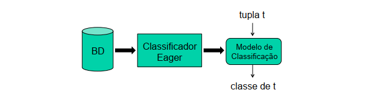

- Lazy:
	- não há construção de modelos;
	- custo computacional mais caro para classificar a tupla de entrada;
	- não necessita retreinar o modelo em caso de atualização da base;
	- exemplo: k-NN.
	
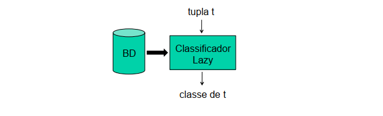

## Aula 5: Naive Bayes

### Características

* Classificadores Bayesianos são classificadores
estatísticos, que se baseiam no Teorema de Bayes.

* Trabalham com a idéia de calcular a probabilidade
de uma instância de entrada pertencer a cada uma
das classes.

* Naive Bayes é o mais popular classificador Bayesiano
e apresenta resultados competitivos em termos de
acurácia e tempo de processamento.

### Formulação do modelo

* O classificador Naive Bayes calcula a probabilidade a posteriori
P(Ci | X), probabilidade de X ser da classe Ci considerando os
valores dos atributos de X (para cada classe Ci);

* O classificador decide que X é da classe Ci se e somente se
P(Ci | X) for maior do que P(Cj | X) para qualquer outra classe Cj,
ou seja, X é da classe Ci se e somente se:
	* P(Ci | X) > P(Cj | X) para todo 1 ≤ j ≤ m, j ≠ i

A probabilidade *a posteriori* P(Ci | X) é:

```
P(Ci | X) = P(Ci ∧ X) / P(X)
```

Entretanto, não se consegue estimar P(Ci ∧ X) a partir da base, pois é 
grande a chance de não haver outros elementos com as características de
X e da classe Ci.

### Teorema de Bayes

 A probabilidade a posteriori P(Ci | X) será calculada a partir do
Teorema de Bayes:
```
P(Ci | X) = P(X |Ci) ⋅ P(Ci) / P(X)
```

* Como P(X) é constante para todas as classes, basta
maximizar o numerador:
```
P(Ci | X) α P(X |Ci) ⋅ P(Ci)
```

**ATENÇÃO:** Dado o valor da classe, os valores dos atributos são tomados por
*condicionalmente independente entre si*. Assim:

Se A e B são independentes: P(A|B) = P(A), e:

Se A e B são independentes dado C: P(A|B∧C) = P(A|C).

Finalmente:
```
P(X | Ci) = P(X1 | Ci) . P(X2 | Ci) . ... . P(Xn | Ci), onde:
X = {X1, X2, ..., Xn}, são os atributos de X.
```

### Correção de Laplace

Como P(X | Ci) se trata de um produtório, qualquer probabilidade zero 
pode zerar o resultado geral. Assim aplica-se a correção de laplace:

Suponha que para a classe buys-computer=yes, em uma base de treinamento 
de 1000 tuplas, tem-se 0 tuplas com age<=30, 990 tuplas com age=31..40,
e 10 tuplas com age>40.

Adiciona-se uma tupla com a classe buys-computer=yes
para cada valor distinto do atributo age.

Dessa forma, as probabilidades que seriam:
0/1000=zero; 990/1000=0,990 e 10/1000=0,010;

passam a ser:
1/1003=0,001; 991/1003=0,988 e 11/1003=0,011.

## Aula 6: Avaliação de Classificadores

### Procedimentos Básicos

- Dividir a base de dados em:
	- base de treinamento; e
	- base de teste.
	
- Calcular acurácia (taxa de acerto): 
```
total_acertos/total_base_teste
```

- Calcular taxa de erro (classificações erradas): 
```
total_erros/total_base_teste
```

### Particionamentos

* Hold out
	* 2/3 para treinamento;
	* 1/3 para teste.
	
* Random subsampling
	* Hold out executado k vezes;
	* Acurácia obtida a partir da média das acurácias das k execuções.
	
* k-Fold Cross Validation
	* Base particionada em k partições aleatórias do mesmo tamanho (aproximadamente);
	* Treinamento e teste executados k vezes;
	* Em cada execução:
		* 1 partição de teste; e
		* k-1 partições de treinamento.
	* Todas as partições são usadas para teste em algum momento; e
	* Acurácia = total_acerto/total_base_dados.
	
* Stratified Cross-Validation
	* Cada partição utilizada na técnica k-fold cross validation deve possuir a 
mesma distribuição de classes da base original.

* Leave-one-Out
	- Mesmo que k-fold cross validation quando k é o número de instância da base 
de dados.

### Erros

* Erro de Generalização
	* Medido a partir da base de teste (a partir de elementos não vistos 
	previamente), indica a capacidade de generalização do modelo.

* Erro de Treinamento
	* Medido a partir da base utilizada para treinar o modelo.
	
### Overfitting vs Underfitting

- Overfitting:
	- Ocorre quando o modelo se ajusta bem aos dados de treino, mas não possui 
capacidade de generalização, ou seja, quando o erro de treino é baixo e o de 
generalização é alto;
	- O modelo “decora” os dados de treinamento e não consegue aprender a partir 
deles.
- Underfitting
	- Ocorre quando o modelo sequer se ajusta bem aos dados de treino.
	
### Matriz de Confusão

Caso geral:

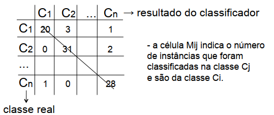

Em caso de classe binária:

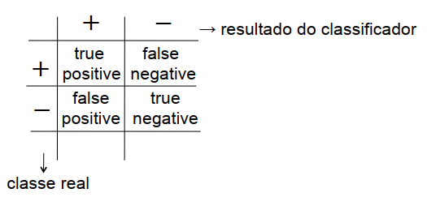

### Métricas de Confusão

**Precision**: Fração dos elementos classificados como positivos que são
realmente positivos.
```
Precision = TP / (TP + FP)
```
Ex.: De todos classificados como SPAM, quantos eram realmente SPAM.

**Recall (Ou Sensitivity)**: Fração dos elementos positivos que foram classificados como
positivos.
```
Recall = TP / (TP + FN)
```
Ex.: De todos os SPAMS, quantos foram classificados como SPAM.

**F-Measure (Média Harmônica)**: Quanto maior, maior a qualidade do precision e recall.
```
F-Measure = 2.Pr.Rc / (Pr+Rc)
```

### ROC (Receiver Operating Characteristics) Curve

Curva que visa sintetizar as várias matrizes de confusão de uma análise com vários
thresholds (pontos de corte). Quanto mais alto um ponto da curva, maior sua taxa
de TP e quanto mais à esquerda for o ponto da curva, menor sua taxa FP. A diagonal
do meio representa pontos onde a taxa de TP é igual à de FP.

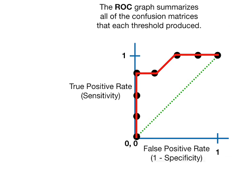

### AUC (Area Under the Curve)

Área utilizada para comparar diferentes ROC Curves:

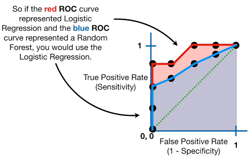

## Aula 8: Regras de Associação

### Definição

Uma regra de associação representa um padrão de relacionamento entre itens de 
dados de um domínio de aplicação que ocorre com uma determinada frequência na 
base de dados.

```
{candidíase} => {pneumonia}
{café, leite} => {pão, manteiga, queijo}
```

**IMPORTANTE**: O elemento da esquerda da regra chama-se antecedente e o da
direita, consequente.

### Suporte

> O suporte de uma regra \{X} => \{Y} é definido pela porcentagem de transações
que incluem todos os itens do conjunto X U Y.

Representa a franção das transações que satisfazem tanto o antecedente quanto o
consequente. *Indica a relevância da regra.*

### Confiança

> A confiança de uma regra \{X} => \{Y} é definido pela porcentagem de transações 
que incluem os itens X e Y em relação a todas que incluem os itens de X.

Representa o grau de satisfatibilidade do consequente,
em relação às transações que incluem o antecedente.

*Representa a probabilidade do consequente acontecer
dado que o antecedente aconteceu.*

### Mineração de Regras de Associação

- Entrada:
	- Base de dados de transações;
	- Suporte mínimo; e
	- Confiança mínima.
- Saída:
	- Todas as RA que satisfazem os requisitos mínimos de suporte e confiança.
	
Exemplo:

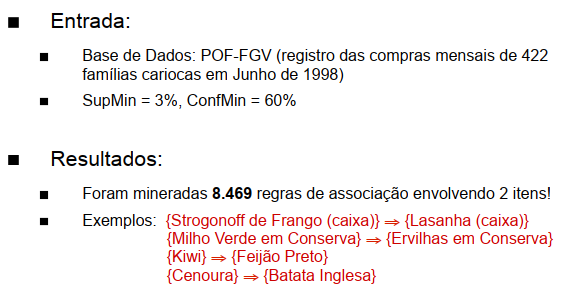

### Regras de Associação em Taxonomias

Regras de Associação podem ser indicadas em taxonomias, exemplo:

Considere a taxanomia abaixo:

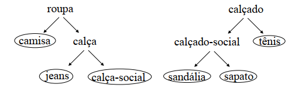

Acrescentando-se RA:

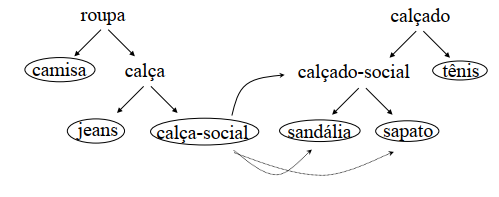

É possível que as duas regras a seguir não tenham o suporte desejado.
```
{calça-social} => {sandália}
{calça-social} => {sapato}
```

Porém, a regra envolvendo a generalização calçado-social pode ser relevante.
```
{calça-social} => {calçado-social}
```

### Regras de Associação Quantitativas (Relacionais ou Multidimensionais)

> Regras de associação quantitativas são utilizadas quando se deseja minerar 
padrões em bases de dados relacionais (formadas por atributos quantitativos 
e atributos categóricos).

Tabelas = Relações

Atributos = dimensões

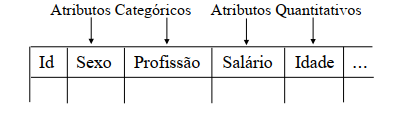

Exemplo:
```
(sexo="M") ∧ (20 ≤ idade ≤ 30) ∧ (opção-sex="heterossex") ⇒ (usuário-drogas="S")
```

Esta regra indica, com confiança C, que pacientes portadores do HIV, heterossexuais,
entre 20 e 30 anos, do sexo masculino têm C% de chance de serem usuários de drogas.

### Meta-Regras

- Permitem a especificação do tipo de regra que se deseja minerar;
- Podem funcionar como restrições definidas pelo usuário; e
- Podem representar hipóteses a serem confirmadas.

Exemplo:
```
P1(X,Y) ∧ P2(X,Z) ⇒ buys(X,“educational software”)
```

Uma possível regra minerada:
```
age(X,[30,39]) ∧ income(X,[41K,60K]) ⇒ buys(X,"educational software")
```

## Aula 9: Medidas de Interesse

### Modelo Suporte / Confiança

* O número de regras gerado costuma ser extremamente volumoso. Identificar as 
regras realmente úteis e interessantes torna-se uma tarefa difícil.

* O modelo gera regras redundantes, ilusórias ou até mesmo contraditórias.

Exemplo de análise de dependência:

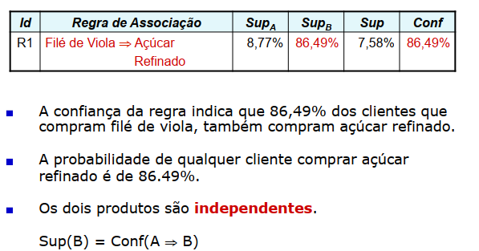

### Lift

> Indica o quanto mais frequente torna-se o consequente quando o antecedente ocorre.
```
Lift(A => B) = Conf (A => B) / Sup(B)
```

Conf (A => B) = Sup(A U B) / Sup(A)

Lift(A => B) = (Sup(A U B) / Sup(A)) / Sup(B)

```
Lift(A => B) = Sup(A U B) / Sup(A) x Sup(B)
```

Sup(A U B): Suporte real de A ∧ B

Sup(A) x Sup(B): Suporte esperado de A ∧ B

### Rule Interest ou Leverage

> Diferença entre o suporte real e o suporte esperado da regra:

```
RI(A => B) = Sup(A U B) – (Sup(A) x Sup(B))
```

### Conviction

> Indica o quanto menos frequente torna-se o inverso do consequente quando o
antecedente ocorre.
```
Conv(A => B) = Sup(-B) / Conf(A => -B)
```

Se o valor de Conv for alto, indica que a ocorrência de A diminui a chance 
de –B acontecer, ou seja, aumenta a chance de B acontecer.