# Mineração de Dados

## Resumo

## Aula 1: Introdução

### Conceito

> Processo de descoberta de novas informações e conhecimento,
no formato de modelos, regras e padrões, a partir de bases de dados.

```
A base de dados pode ser um banco de dados tradicional, 
um data warehouse ou qualquer outra forma de repositório.
```

### Aplicações de mineração de dados

- Detecção de spam; 
- Detecção de patologias por análise de imagens;
- Detecção de fraudes;
- Mineração de regras de associação; e
- Análise de sentimentos.

### Classificação

* Mineração Preditiva; e
* Mineração Descritiva.

### Mineração Preditiva

> Deseja-se prever o valor desconhecido de um determinado atributo, a
partir da análise histórica dos dados armazenados na base (base de treinamento).

### Mineração Descritiva

> Procura-se extrair padrões e regras que descrevam características importantes
dos dados do domínio de aplicação.

### Mineração de Dados

> Etapa principal do processo de KDD (Knowledge Discovery in Databases), na qual é
realizada a busca por novas informações e conhecimento.

### KDD (Knowledge Discovery in Databases)

É composto por seis fases (Navathe):

* Seleção de dados;
* Limpeza de dados;
* Enriquecimento dos dados;
* Transformação dos dados,
* **Mineração dos dados**; e
* Apresentação e análise dos resultados.

### Tarefas em mineração de dados

* Regras de Associação (RA);
* Padrões de Sequências;
* Classificação; e
* Clusterização.

### Regras de Associação (RA) aka market basket analysis

> Uma RA representa um padrão de relacionamento entre itens de dados do domínio
da aplicação que ocorre com uma determinada frequência na base.

Exemplos:

```
{fralda} => {cerveja}
{pão, manteiga} => {leite} , confiança de 80%
{candidíase} => {pneumonia}
```

RAs são extraídas de bases de dados que contém transações.

Transações:

|ID|Itens comprados|
|:-:|:------------:|
|1| leite, pão, refrigerante|
|2| cerveja, carne|
|3| cerveja, fralda, leite, refrigerante|
|4| cerveja, fralda, leite, pão|
|5| fralda, leite, refrigerante|

RAs: \{A} => \{B}

| RA | Confiança (A&B)/A | Suporte (A&B)/Total |
|:--:|:---------:|:-------:|
|\{fralda} => \{cerveja}|66% (2/3)|médio (2/5)|
|\{fralda} => \{leite}|100% (1/1)|alto (3/5)|
|\{leite} => \{fralda}|75% (3/4)|alto (3/5)|
|\{carne} => \{cerveja}|100%(1/1)|baixo (1/5)|

### Padrões de Sequências

> Padrões de Sequência representam sequências de conjuntos de itens que ocorrem
nas transações de diferentes consumidores, com determinada frequência (em ordem).

Exemplo:

|Consumidor|Data/Hora|Produtos|
|:--:|:---------:|:-------:|
|João|01.08.2001/17:01|leite, pão|
|João|03.08.2001/14:25|carne, cerveja|
|João|10.08.2001/21:15|queijo, manteiga, sal|
|-|-|-|
|Marcos|05.08.2001/10:16|leite, ovos|
|Marcos|08.08.2001/18:30|leite, manteiga|

```
Padrão de Sequência: {(leite)(queijo, manteiga)}
```

### Classificação

> Um classificador estima/prevê, entre um conjunto pré-definido de classes, aquela
a qual pertence um elemento, a partir de seus atributos.

* Em última análise é uma função que realiza tal mapeamento; 
* A função é descoberta a partir de um modelo de função/técnica (escolhida) e 
uma base de treinamento.

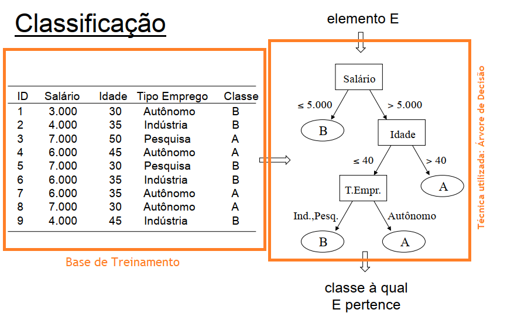

### Agrupamento (Clustering)

> Agrupar ("clusterizar") significa identificar um conjunto finito de categorias
>(ou grupos/clusters) que contêm objetos similares.

**ATENÇÃO:** Grupos não são previamente definidos!

Exemplo:

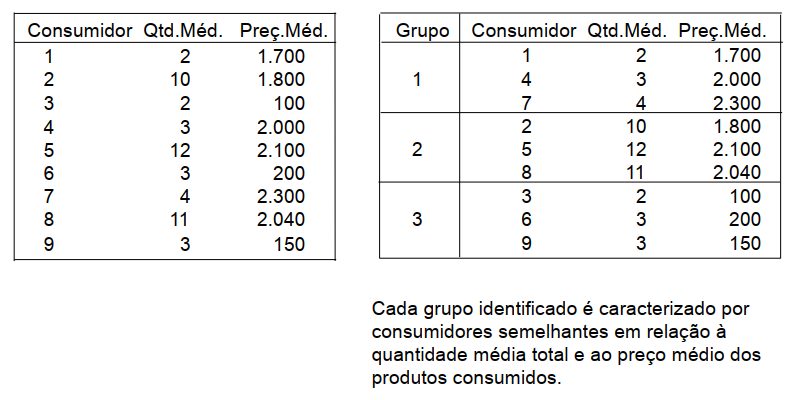

### Técnicas de Mineração de Dados

- Classificação
	- Árvores de Decisão;
	- k-NN;
	- Classificador Bayesiano, etc.
- Associação/Padrões
	- Algoritmo de Extração de Regras de Associação/Padrões
- Clusterização
	- Algoritmos de Particionamento;
	- Algoritmos Hierárquicos, etc.

### Técnica Supervisionada vs Técnica Não Supervisionada

**Supervisionado**: *Quando o atributo classe dos elementos da base de
treinamento é conhecido, uma vez que tal classe foi informada a partir de
uma ação externa (supervisionada).* Ex.: ***Classificação.***

**Não Supervisionada**: *Quando os elementos da base de treinamento não possuem
um atributo classe previamente informado, bem como ausência de separação em
grupos (nem mesmo em quantidade de grupos).* Ex.: ***Clusterização.***

### Modelo de Mineração de Dados

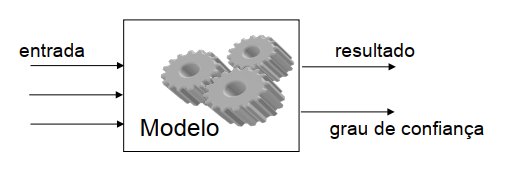

### Mineração de Dados Direta

> Através de uma técnica de mineração, extrai-se ou treina-se um modelo que 
> será posteriormente utilizado. 

* Tarefas Preditivas: classificação, regressão, etc.

```
Mineração caracterizada pela existência de um campo específico 
cujo valor deve ser estimado a partir dos valores dos demais 
atributos.
```

### Mineração de Dados Indireta

> Através de uma técnica de mineração, extraem-se padrões significativos que 
serão posteriormente avaliados.

* Tarefas Descritivas: regras de associação, clusters, etc.

```
O resultado da mineração complementa o conhecimento do especialista e deverá 
ser examinado e avaliado por este.
```

## Aula 2: Árvore de Decisão (Classificação)

### Conceito de Classificação

> Identificar a classe a qual um elemento pertence a partir de suas características.
O conjunto de possíveis classes é discreto e predefinido.

Exemplo:


Características:

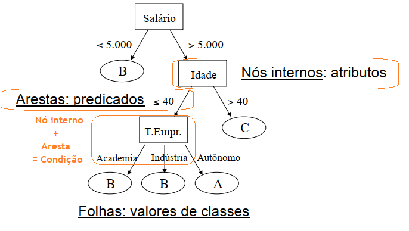

### Regras de Classificação

> Cada caminho da raiz até a folha representa uma regra, definida como a conjunção
das condições percorridas, implicando no valor da classe encontrada na folha.

**ATENÇÃO:** A árvore deve ser definida de forma que, para um mesmo registro, 
haja um e apenas um caminho da raiz até a folha.

```
(Sal ≤ 5k) ⇒ Classe = B
(Sal > 5k) ∧ (Idade > 40) ⇒ Classe = C
(Sal > 5k) ∧ (Idade ≤ 40) ∧ (TEmpr = Autônomo) ⇒ Classe = A
(Sal > 5k) ∧ (Idade ≤ 40) ∧ (TEmpr = Indústria) ⇒ Classe = B
(Sal > 5k) ∧ (Idade ≤ 40) ∧ (TEmpr = Academia) ⇒ Classe = B
```

### Taxa de Erro de Treinamento de Regras

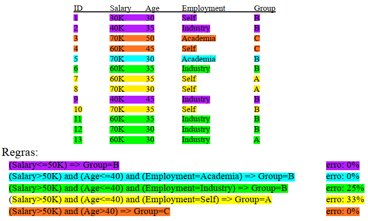

### Taxa de Erro Total ou Erro de Treinamento

> A taxa de erro total de uma AD equivale à soma ponderada das taxas de erro 
de cada folha, considerando-se a probabilidade associada a esta folha.

Exemplo:
```
Erro Total = 0,25 * X + 0,33 * Y, onde:
X = 4/13, onde 4 é a # da regra verde e 13 é o total de tuplas.
Y = 3/13, onde 3 é a # da regra amarela e 13 é o total de tuplas.
```

**ATENÇÃO:** O erro é calculado sobre os dados de _treinamento_!

### Algoritmos ID3, C4.5 e CART

Estrutura comum aos algoritmos:

- Entrada:
	- Base de treinamento;
	- Lista de atributos independentes; e
	- Definição do atributo dependente (alvo ou objetivo).
- Saída:
	- AD que permite classificar um novo registro a partir de seus atributos independentes.
	
### Como gerar a melhor AD? Como escolher os atributos/nós?

O algoritmo ID3 utiliza medida de Ganho de Informação, que se baseia no conceito
de entropia. Utiliza-se de uma heurística que visa minimizar a quantidade de testes
necessários para classificar um registro.

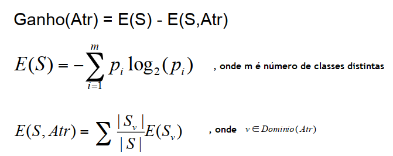

### Medida Gain Ratio

Um problema da medida Ganho de Informação é que atributos com muitos valores 
são beneficiados. Caso extremo: atributo identificador (CPF).

O algoritmo C4.5 tenta resolver esse problema com uma extensão da medida 
Ganho de Informação, chamada Gain Ratio. Trata-se de um tipo de normalização 
do Ganho de Informação.

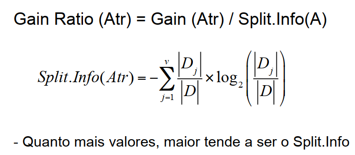

### Medida Gini Index

Utilizada pelo algoritmo CART, tem por objetivo medir o grau de impureza da 
distribuição de classes da base D.

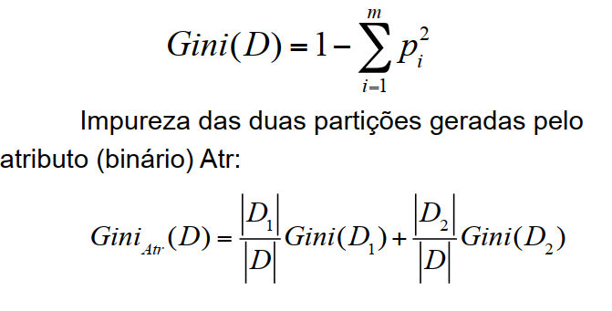

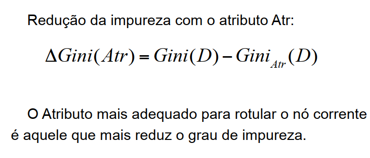

## Aula 3: Random Forest

### Características

- Trata-se de um classificador composto por um comitê (ensemble) de N árvores de 
decisão, onde N é um parâmetro de entrada da técnica. No momento da classificação,
as árvores votam e a classe predominante será a classe da instância de entrada.
- Seja D a base de treinamento, com d elementos. Cada árvore é construída a partir
de uma amostra de D com reposição, de tamanho d. Portanto, algumas tuplas de D 
podem aparecer mais de uma vez na amostra, enquanto outras podem não aparecer. 
Aproximadamente 63,2% da base original ocorre em cada amostra.
- A cada vez que um nó da árvore está sendo construído gera-se um subconjunto 
aleatório dos atributos disponíveis, de tamanho F (outro parâmetro de entrada
da técnica), e apenas esses atributos serão candidatos a rotular o nó corrente.

**ATENÇÃO**: Em caso de regressão, a saída é a média dos valores de saída das árvores.

### Desvangatens

* Bons resultados para classificação, mas não tão bons para regressão; e
* Como se trata de várias árvores, perde-se a intuitividade do modelo.

## Aula 4: k-NN (k Nearest Neighbor)

### Características

* Classificador k-NN (k-Nearest Neighbor) se baseia na ideia
de aprendizagem por analogia. A classe de uma tupla de
entrada será determinada pelo conhecimento das classes de
tuplas similares da base de treinamento.

* Cada tupla possui n atributos e, portanto, pode ser
caracterizada por um ponto em um espaço n-dimensional.

* A técnica procura pelas k tuplas de treinamento mais
próximas à tupla a ser classificada no espaço n-dimensional.
Essas tuplas serão os k vizinhos mais próximos.

*Depois de identificados os k vizinhos mais próximos da tupla t de entrada 
a ser classificada, o k-NN atribui a t a classe predominante entre esses k 
vizinhos.*

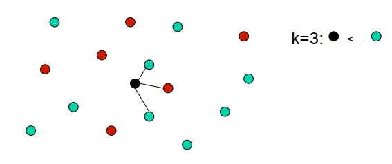

**IMPORTANTE:** Em geral escolhem-se valores ímpares de k para evitar empates.

### Cálculo de Proximidade / Semelhança

> A proximidade ou semelhança é definida a partir de uma métrica de distância,
como a distância euclidiana. Outras função de distância podem ser utilizadas: distância
de manhanttan, distância minkowski, etc.

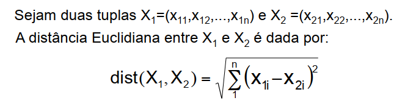

*Quanto menor o dist, mais próximas são as tuplas da entrada da função.*

**ATENÇÃO:** Os atributos devem ser numéricos e portanto convertidos em números
quando necessário.

### Normalização dos atributos

* É importante que os atributos sejam normalizados para evitar que atributos
diferentes contribuam de forma diferente no cálculo da distância.

* Normalização min-max transforma o valor v de um atributo em um valor v' no
intervalo [0,1]:

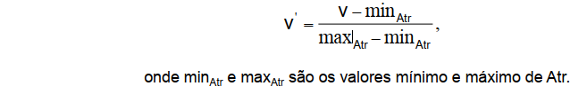